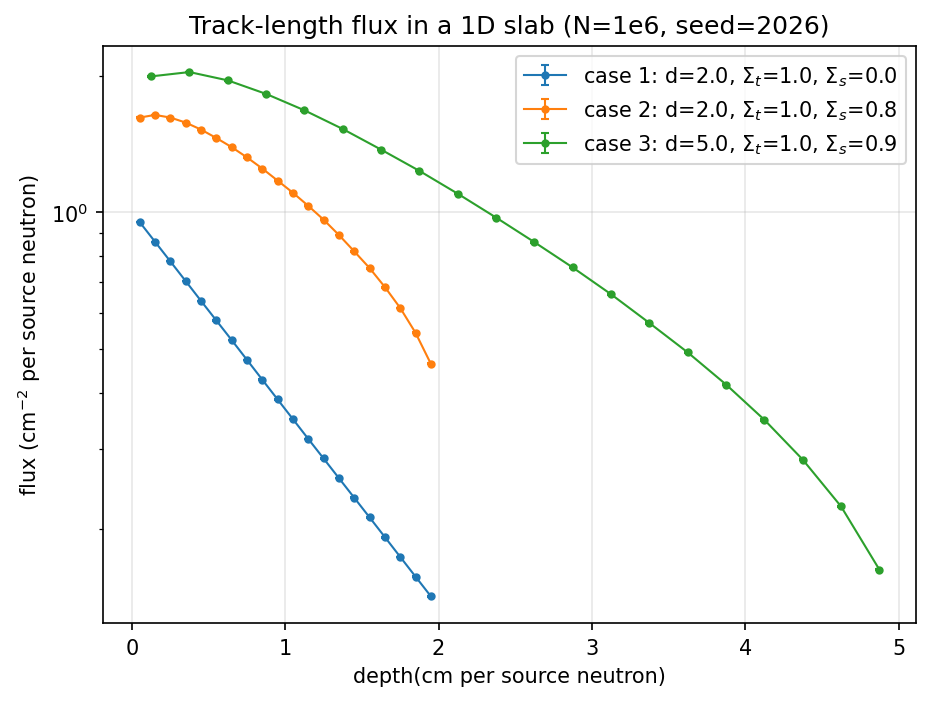
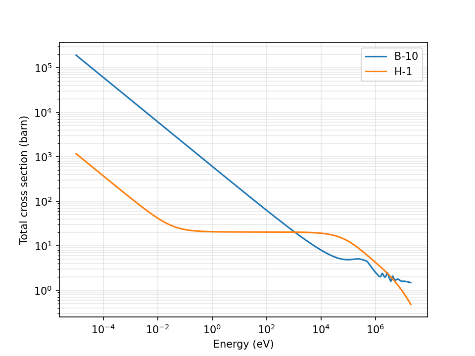
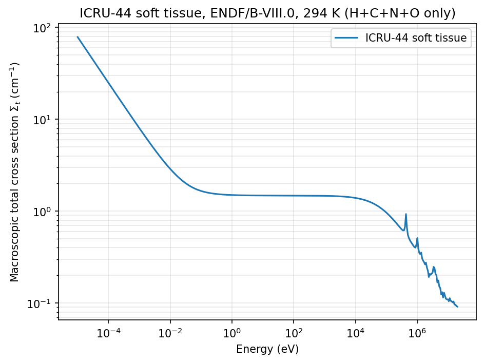

# bnct-mc-transport

一个从零手写的蒙特卡罗中子输运程序。

最终目标是 **GPU 加速的 BNCT 剂量计算引擎**；本仓库当前处于 **Python 参考实现阶段**，
之后重写为 C++ 并移植到 CUDA，再与 OpenMC 对拍。

> **这个仓库里的每一行代码都是我自己敲的。** 提交历史就是开发过程本身，
> 包括每一次踩坑和修正。没有代码生成器写的部分。

---

## 环境与运行

- Python 3.10（conda 环境 `openmc`）
- 第 1–4 课**只用标准库 `math`**，不依赖 numpy
- `plot_lesson03_scaffold.py` 另需 matplotlib 3.10.9 + numpy 2.2.6
- 第 5 课起需要 **h5py + numpy + matplotlib**

⚠️ **第 5 课的脚本需要 ENDF/B-VIII.0 截面库，该库约 15 GB，不在本仓库内。**
用的是 LANL 版 `lib80x_hdf5`（589 个核素的 `.h5` + `cross_sections.xml`）。
路径写在各脚本开头的 `LIB = r"..."` 一行，自行改成本机路径即可。

每个 `lessonNN_*.py` 都是可独立运行的脚本：

```
python lesson03_tally.py
```

**所有验证都写成 `assert`，脚本正常退出即等于验证全部通过。**
不要加 `-O` —— 那会关掉全部 assert，程序看上去照跑，验证却一条都不剩。

---

## 每课验证了什么

下面每一个数字都是实际跑出来的，不是估的。参数统一 `seed=2026`。

### 第 1 课：随机数、抽样、误差

| 文件 | 内容 | 验证判据与实测值 |
|---|---|---|
| `lesson01_lcg.py` | 手写线性同余发生器（a=1664525, c=1013904223, m=2³²） | N=1e6 样本均值 **0.499922**（理论 0.5）；10 个等宽箱计数落在 **99562–100512**（理论每箱 100000） |
| `lesson01_flight.py` | 逆变换法抽飞行距离 `s = -ln(1-ξ)/Σt` | N=1e6：均值 **0.599395** vs 1/Σt=0.600312（−0.15%）；中位数 **0.415513** vs ln2/Σt=0.416105；未碰撞穿透率 d=0.5/1.0/2.0/3.0 cm 实测 **0.434267 / 0.188391 / 0.035700 / 0.006614**，解析 0.434787 / 0.189039 / 0.035736 / 0.006755 |
| `lesson01_error.py` | 样本方差、均值标准误、相对误差 R | 收敛率：`R/(1/√N)` 在 N=1e3→1e6 上为 **1.0120 / 1.0182 / 0.9995 / 0.9994**（指数分布下该比值恒为 1）。误差棒可信度：20 个不同种子，真值落在 1σ 内 **16/20**、2σ 内 **20/20**（理论 68% / 95%） |

### 第 2 课：三维方向与一维平板

| 文件 | 内容 | 验证判据与实测值 |
|---|---|---|
| `lesson02_direction.py` | 各向同性方向抽样（抽 μ 不抽 θ） | 正确做法：⟨u²⟩=**0.33227**、⟨v²⟩=**0.33402**、⟨w²⟩=**0.33371**（应为 1/3）；w 的 10 个分箱 **19903–20134**（每箱应 20000）。脚本里保留了错误做法（均匀抽 θ）作对照：w 两端箱 **41090 / 40928**，中间约 **12770** —— 粒子堆在两极。**⟨u⟩⟨v⟩⟨w⟩ 三个均值在两种做法下都接近 0，看不出这个错；只有分布能。** |
| `lesson02_slab.py` | 1D 平板 T/R/A（填空版） | 见 v3 |
| `lesson02_slab_v3.py` | 同一问题的**无脚手架重写**（关掉全部自动补全，约 180 行） | N=1e5：三个 case 的 `T+R+A=1`（assert，容差 1e-12）；case1 反照率 **严格等于 0**；case1 透射 **0.135300** vs exp(−2)=0.135335（**−0.03σ**）；case1 平均碰撞数 **0.864700** vs 1−exp(−2)=0.864665；case2 **2.2473**、case3 **5.1503**；触顶最大事件数的历史数为 **0** |

### 第 3 课：径迹长度估计器与深度通量

`lesson03_tally.py` — N=1e6，20 层分箱，每层带误差棒（输出存档见 `lesson03_N1e6.txt`）

| case | 几何与截面 | 实测 |
|---|---|---|
| 1 | d=2.0, Σt=1.0, Σs=0.0 | T=**0.135259**（vs exp(−2)，**−0.22σ**）、R=**0**、A=**0.864741**、T+R+A=1；平均碰撞数 0.864741 |
| 2 | d=2.0, Σt=1.0, Σs=0.8 | T=**0.287048**、R=**0.265593**、A=**0.447359** |
| 3 | d=5.0, Σt=1.0, Σs=0.9 | T=**0.076926**、R=**0.412353**、A=**0.510721** |

- case1 的 20 层通量从 **0.951532** 降到 **0.142143**，每层相对误差 R 从 **0.00018** 升到 **0.00243**，全部远低于 0.05 的可信线。
- **半对数斜率判据**：case1 是纯吸收，通量应严格按 `exp(-Σt·z)` 衰减，于是
  `ln(φ₁/φ₂₀)/Δz = ` **1.0007**，应等于 Σt = 1.0。这是一条能从图上用尺子量出来的判据。

`plot_lesson03_scaffold.py` — 把三个 case 画成带误差棒的深度通量曲线。
**误差棒的真实性单独验过**：把误差整体放大 100 倍，图上肉眼可见变粗，再改回 1.0。



### 第 4 课：弹性散射运动学与慢化

`lesson04_energy.py` — 九条验证，A=1（氢）与 A=12（碳）各跑一遍。

| 判据 | A=1 实测 / 解析 | A=12 实测 / 解析 |
|---|---|---|
| ① `E'/E` 落在 [α, 1] 内 | [0.000001, 0.999998] ⊂ [0, 1] | [0.715977, 0.999999] ⊂ [0.715976, 1] |
| ② `E'/E` 分布的卡方（df=19） | 19.3267 < 43.82 | 19.3267 < 43.82 |
| ③ 平均对数能降 ξ | 1.000657 / 1.000000（**+0.66σ**） | 0.157885 / 0.157769（**+1.20σ**） |
| ④ 实验室系 ⟨μ⟩ = 2/(3A) | 0.666422 / 0.666667（**−1.04σ**） | 0.054863 / 0.055556（**−1.20σ**） |
| ⑤ ⟨E'/E⟩ | 0.499639 / 0.500000（**−1.25σ**） | 0.857886 / 0.857988（**−1.25σ**） |
| ⑥ Wald 恒等式（慢化到 0.025 eV 的碰撞数） | 49.9878 / 50.0000（**−0.39σ**） | 7.8901 / 7.8884（**+0.54σ**） |
| ⑦ 归一化方差 | 0.991066（偏 **−0.89%**，工程容差 ±3%） | 0.992231（偏 **−0.78%**） |
| ⑧ 超越量普适界（**单边**，不许加 abs） | 1.033863 ∈ [0.5765, 1.0902] | 0.758822 ∈ [0.5277, 1.1390] |
| ⑨ 更新理论修正后的碰撞数 | 19.2314 / 19.1975（**+1.13σ**） | 116.1018 / 116.0288（**+1.58σ**） |

> ⑦ 用的是 ±3% 的工程容差，不是 σ 判据；⑧ 是**单边**界，加 `abs()` 会放过物理上不可能的负值；
> ② 的 43.82 是 χ² 分位数，也不是 σ 判据。**这三条刻意不套统一模板。**

### 第 5 课：连续能量截面（ENDF/B-VIII.0，294 K）

`xslib.py`（读库与求和）、`plot_xs.py`（出图）、`lesson05_tissue_scaffold.py`（软组织混合）、
`h5_first_look.py` 与 `explore_reactions_scaffold.py`（结构探路）。

**总截面不在库里。** OpenMC 的 HDF5 格式故意不存 MT=1 —— ENDF 的 MT 号是一棵树，
总截面是树根，存了就有和叶子对不上的风险。程序按每个反应道的 `redundant` 属性**只取叶子求和**；
阈值反应的截面数组只从 `threshold_idx` 开始存，求和前必须按它对齐到同一张能量网格上。

**这条对齐不做不会报错**，只会把高能区的截面贴到低能区——所以它需要判据，不能靠眼睛。

**树结构是在数据上验出来的，不是从手册抄的**（B-10，2.463750e-02 eV）：

```
MT=107  3895.7440   =  MT=800 245.3702 + MT=801 3650.3740     逐位相等
MT=105  0.00683616  =  MT=700 0.00683616                      逐位相等
MT=103  0.000573582 =  MT=600 0.000573582                     逐位相等
```

B-10 共 58 个反应道，其中 `redundant=1` 的 10 个（MT=4/103/105/107/203/204/205/207/301/444）。
**MT=301 与 444 根本不是截面**——它们是 KERMA 与损伤能，单位 eV·barn，实测值 **9.12e+09** 与 **6.36e+07**。
截面不可能有 10⁹ barn 这个量级，**单看数字就能判掉**。

| 判据 | 抓什么 | 实测 |
|---|---|---|
| A 长度对齐 | `len(xs) + threshold_idx == len(E)` 对每个道成立 | 58/58 过 |
| B 二分对拍 | 自写 `find` 与 `np.searchsorted(side="right")-1` 给同一下标 | 一致，i₀=242 |
| C 求和完整性 | `1.0 < total/MT107 < 1.01` —— **下界 1.0 是严格不等式**，不是容差 | **1.000671** |
| D 正定 | 总截面处处 > 0 | 过 |
| E 量级 | 参与求和的单道 < 1e6 barn（防 `redundant` 标志失效） | 过 |

> 判据 C 的两端来源不同：**下界来自不等式**（total 含 MT800+MT801，其和恒等于 MT107，再加一堆非负的道，所以恒 ≥ 1）；
> **上界来自"要抓的错有多大"**（重复加冗余道会让比值 ≈ 2）。
> 曾用过的 `0.9` 下界会放过"漏加 MT=800"（比值 0.9377）—— **松容差漏掉的正是最难自己发现的那类错。**

**B-10 总截面 `σ(2.463750e-02 eV) = 3898.3567 barn`。**

**1/v 律**：热能区双对数斜率 **p = −0.499776**（1/v 要求 −0.5）。
偏差 2.24e−4 不是噪声，可以算出来：热能点弹性散射占总截面 5.64e−4 且不服从 1/v，
按 `p = −½(1 − B/σ)` 预测 **−0.499718**；实测更负 6e−5，因为弹性本身也在缓慢下降（37.68 → 36.55 barn）。

**独立对拍**：把 MT=107 按 1/v 从 2.4638e−2 eV 外推到 0.0253 eV 得 **3844.40 barn**，
与另一条路径独立测得的 **3844 barn** 相对差 **1.04e−4**。



**H-1：一个被"教科书值"坑住的判据。**
自由原子总截面是 20.44 barn，而库里实测 `σ(2.464e-02 eV) = ` **30.6492 barn**，高出 48%。
差的不是错，是 **294 K 靶核热运动**——库里的数据已经过自由气体展宽。用

```
σ̄/σ_free = (1 + 1/(2β²))·erf(β) + exp(−β²)/(β√π),    β² = A·E/(kT)
```

算得 **30.654**（相对差 **1.5e−4**）；在 1e−5 eV 处算得 **1177.6**，实测 **1177.2619**（相对差 **2.9e−4**）。

> **教训写在这里**：一个查来的"教科书值"，用作判据之前必须先问它在什么条件下成立。
> 20.44 barn 的条件是"自由原子、靶核静止"，而数据是"294 K 自由气体"。**同一个物理量，两个条件，差 50%。**

**ICRU-44 软组织宏观总截面**（ρ = 1.06 g/cm³，原子量取自各 `.h5` 的 `atomic_weight_ratio`）：

| 核素 | 质量分数 | N (cm⁻³) | σ(0.0246 eV) barn | Σ (cm⁻¹) |
|---|---|---|---|---|
| H-1 | 0.102 | 6.4606e22 | 30.6562 | **1.98057** |
| C-12 | 0.143 | 7.6091e21 | 4.9573 | 0.03772 |
| N-14 | 0.034 | 1.5499e21 | 12.2066 | 0.01892 |
| O-16 | 0.708 | 2.8256e22 | 3.9172 | 0.11068 |
| | | | **Σt** | **2.14789** |

**平均自由程 1/Σt = 0.4656 cm，氢贡献 92.21%。**
四种元素在各自的能量网格上（631 / 941 / … 点，互不相同），先用 log-log 插值搬到同一张
400 点对数等间距公共网格，再相加。



曲线在 0.3 eV – 1e4 eV 之间有一个 **≈1.48 cm⁻¹ 的平台，那就是"靶核静止"的极限值**；
热能点的 2.148 比它高 1.45 倍，**高出来的全部是 294 K 的热运动**。

**两处已知近似，不藏**：
1. 每种元素只取主同位素（H-1 99.98% / C-12 98.9% / N-14 99.6% / O-16 99.8%），误差 ~1%；
2. 略去 Na/P/S/Cl/K 共 1.3% 质量且**未重新归一化**，Σt 因此偏低约 1%。

### 统计模块

`mcstat.py` — `mean_se` / `dev_sigma` / `row` / `header` / `chi2_uniform` / `check`。

- **自测 1**（贝塞尔方差恒等式）：容差写成 `5/3` 而不是手打 `1.666667` —— 手抄近似值与真值差 3e-7，比 1e-12 的容差大五个数量级。**恒等式级判据不允许出现手抄的近似值。**
- **自测 2**（卡方）：用非零算例 `[12,8,10,10]`、手算 0.8。原来的"全等于期望 → χ²=0"任何"永远返回 0"的实现都能通过，是一条无效判据。
- `chi2_uniform` 里的 `assert expected >= 5` 同时是判据和**适用范围说明书**：期望频数掉到个位数时卡方近似失效，`chi2 < 43.82` 会既不报错也不正确。
- **重构的正确性判据**：抽出模块后，`lesson04_energy.py` 输出 **26 行 = 26 行，0 处不同**；`lesson03_tally.py` **80 行 = 80 行，0 处不同**。

---

## 怎么知道结果是对的

本仓库用四档强度的判据，**强度不同，能下的结论也不同**：

| 档 | 形式 | 例子 |
|---|---|---|
| 1 | **恒等式**，与物理无关，必须逐位成立 | `T+R+A=1`（容差 1e-12）；方向向量模长严格为 1；case1 的 `R≡0`；`MT107 = MT800+MT801` |
| 2 | **解析解 ± 3σ** | `T` vs `exp(-Σt·d)`；⟨μ_lab⟩ vs `2/(3A)`；Wald 恒等式 |
| 3 | **分布形状**（均值过了不代表分布对） | `E'/E` 的卡方；方向抽样的 w 分箱 |
| 4 | **逐位对拍**（重构 / 换实现前后） | `mcstat` 抽取前后输出一字不差 |

**判据本身也会错，本仓库记录了三种形态：**

- **判据不判定**。曾有一条验证只 `print` 不 `assert`，于是函数返回 `None` 时程序照样打印"三条全过"。
  同一个毛病的另一面：第 5 课的 1/v 斜率若靠肉眼在双对数图上量，会读出 **−88.5**；写成 assert 由程序算，是 **−0.499776**。**差 177 倍。**
- **判据的适用条件被忽略**。用"自由原子"的 20.44 barn 去判 294 K 的数据，会判错 48%（见第 5 课 H-1）。
- **判据有分辨率上限**。第 4 档的"0 处不同"只能说明*浮点重结合的差异小到不影响输出*，
  **不能**说明"没有发生重结合" —— 打印只到 6 位小数，而重结合的差异在第 16 位。

**判据有分辨率，超出分辨率的结论它没资格下。**

---

## 目录

| 类别 | 文件 |
|---|---|
| 第 1 课 | `lesson01_lcg.py` `lesson01_flight.py` `lesson01_error.py` |
| 第 2 课 | `lesson02_direction.py` `lesson02_slab.py` `lesson02_slab_v3.py` |
| 第 3 课 | `lesson03_tally.py` `plot_lesson03_scaffold.py` `lesson03_N1e6.txt` |
| 第 4 课 | `lesson04_energy.py` `lesson04_spec.md` |
| 第 5 课 | `xslib.py` `plot_xs.py` `lesson05_tissue_scaffold.py` `h5_first_look.py` `explore_reactions_scaffold.py` |
| 公共模块 | `mcstat.py` `mcstat_spec.md` |
| 白板题（手写练习规格书） | `whiteboard_02_spec.md` `whiteboard_05_spec.md` `whiteboard_05_scaffold.py` `whiteboard_05_rewrite.py` `whiteboard_06_spec.md` `whiteboard_06_loglog.py` |
| 工具讲义 | `tool_debugger_guide.md` `tool_git_guide.md` `tool_matplotlib_guide.md` `matplotlib_spec.md` |

---

## 下一步

| 时间 | 内容 |
|---|---|
| 第 6 课 | 连续能量接进 1D 平板。判据：**单能极限下与 `lesson03_tally.py` 逐位相同** |
| 第 7–8 课 | free-gas 热化与上散射（第 5 课的 H-1 曲线已经看见它）；¹⁰B(n,α)⁷Li 与四分量剂量 |
| **里程碑 1** | 与 OpenMC 对拍：两条深度剂量曲线在 1σ 内重合 |
| 第 10–14 课 | C++ 重写 → CUDA 移植（一线程一历史，atomicAdd 打分） |
| **里程碑 2** | 给出 GPU / CPU 单线程的真实加速比与历史数-时间曲线 |
| 收尾 | 一维锂包层 TBR 算例（14.1 MeV 源，⁶Li(n,α)t 与 ⁷Li(n,n'α)t 两个反应道） |

几何一律一维。BNCT 深度剂量和锂包层 TBR 都是一维量，三维几何不改变物理、
不产生新的验证、也不改变加速比，因此排在 CUDA 之后。
